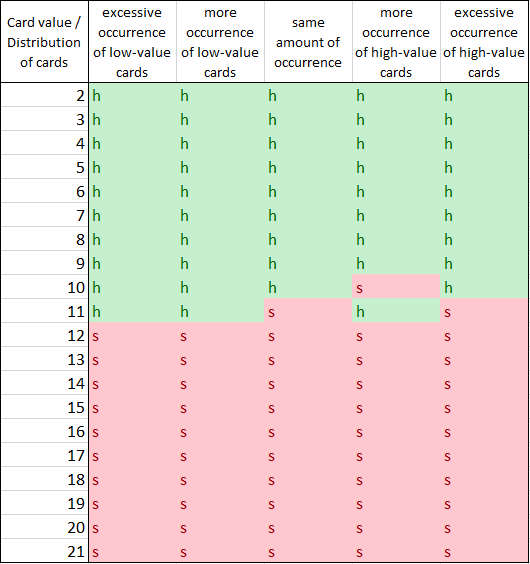
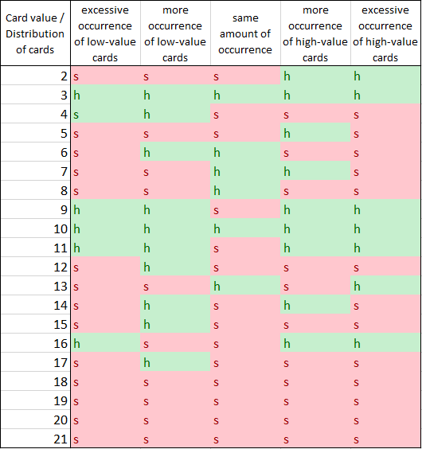

# RL-Blackjack

## Group Information

Name : Tham Yik Foong (20200786) and Qi Fang Rui

Course : Machine Learning in Science MSC

Affiliation : School of Physics and Astronomy, University of Nottingham.

## Overview

This is a code implementation of project and paper - RL-Blackjack

This project address the task assigned to train an agent to play a stylised version of Blackjack using Q-learning algorithm. Reinforcement learning algorithm usually performs generally well in probabilistic environment; technique such as Q-learning algorithm is specifically handy for environment with small state-action spaces. Therefore, we have implemented Q-learning as basis for our agent while also adding some extra capabilities to aid the performance of our agent. 

To compare the performance, we compare our agent with a Q-learning agent without extra capabilities and a rule-based agent. We discover that even our agent can perform better than a basic Q-learning agent, but it only performs equally as a rule-based agent.

[Paper](https://github.com/zfoong/RL-Blackjack/blob/master/RL_Blacjack_Project_and_Paper_B3.pdf) included for implementation details.

## Project setting

Default Hyper-parameter setting

| Hyper-parameter | Default Value |
| --- | --- |
| Number of decks shuffle together | 5 |
| Episode | 1000 |
| Epsilon (Exploration factor) | 1 |
| Learning Rate | 0.2 |
| Epsilon Decay Rate | 10 |
| Max Epsilon | 1 |
| Min Epsilon | 0 |
| Replay Buffer length | 20 |
| Replay Buffer batch | 5 |

## User Guide

Simply run *main.py* to run all 3 agents, agent's Q-table will be saved as a csv file and numpy array file.
Running *blackjack_env.py* to play stylised Blackjack without agent.

## Performance

[Note]  
*AGQ_Extend* is Q-learning agent with extend capabilities  
*AGQ* is Q-learning agent without the capability of divided episode and experience replay  
*AGrule_based* is a rule-based agent  

Below are a graph showing the reward gained from our agents on every episode:

Below table shows mean of total reward of each episode from test episodes:

| Agent | Mean of total reward |
| --- | --- |
| *AGQ_Extend* | 30848 |
| *AGQ* | 28160 |
| *AGrule_based* | 31422 |

Q-table of *AGQ_Extend* (left) and Q-table of *AGQ* (right) at the end of the training below:

